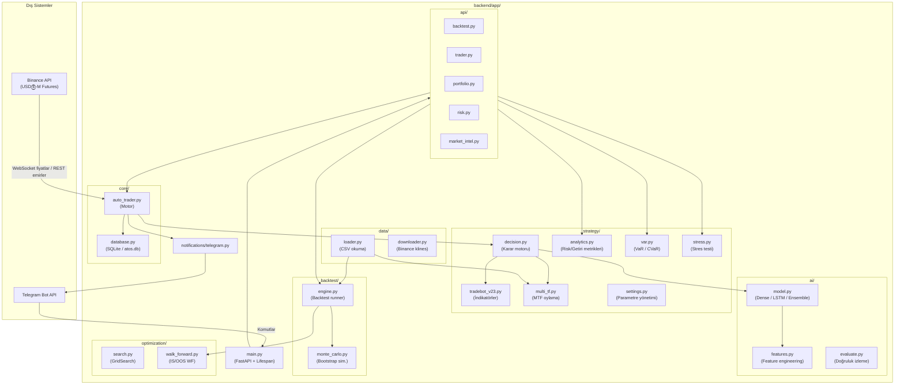

# ATOS-X — Sistem Mimarisi

## Genel Bakış

ATOS-X, Binance USDⓈ-M Futures için otonom bir trading sistemidir. FastAPI tabanlı bir backend, SQLite veritabanı ve Telegram bot arayüzü üzerine kurulmuştur.

---

## Bileşen Diyagramı



---

## Veri Akışı

### Canlı Trading

```
Binance WebSocket
    → auto_trader.on_price_update()
    → decision.decide(symbol, df, settings)
        → tradebot_v23.generate_signal()
        → [MTF] multi_tf.mtf_vote()
        → [AI]  model.Predictor.predict()
    → auto_trader.open_position() / close_position()
    → database.save_trade()
    → telegram.send(bildirim)
```

### Backtest

```
POST /api/v1/backtest/run
    → backtest.engine.run(df, settings)
        → strateji döngüsü (bar-by-bar)
        → analytics.* (Sharpe, Sortino, Calmar, MaxDD)
    → [opsiyonel] monte_carlo.run_monte_carlo()
    → [opsiyonel] walk_forward.walk_forward()
    → JSON yanıt (metrikler + equity eğrisi)
```

### Karar Zinciri

```
generate_signal(df) → RAW_SIGNAL (BUY/SELL/HOLD)
    ↓
multi_tf.mtf_vote()  → ağırlıklı oy (4h=1.0, 1h=0.6, 15m=0.3)
    ↓
Predictor.predict()  → AI olasılığı (0-1)
    ↓
decision_council     → çoğunluk oylaması
    ↓
decide() → {signal, confidence, stop_loss, take_profit, mtf}
```

---

## Veritabanı Tabloları

| Tablo | Açıklama |
|-------|----------|
| `trades` | Açık ve kapalı pozisyonlar |
| `signals` | Üretilen sinyaller geçmişi |
| `backtest_results` | Backtest özet sonuçları |
| `risk_snapshots` | Periyodik VaR anlık görüntüleri |
| `performance` | Günlük equity kayıtları |
| `ai_stats` | Model doğruluk istatistikleri |

---

## Dizin Yapısı

```
ATOS-X/
├── backend/
│   ├── app/
│   │   ├── ai/           # Model, features, evaluate
│   │   ├── api/          # FastAPI router'ları
│   │   ├── backtest/     # Engine, monte_carlo
│   │   ├── core/         # DB, auto_trader
│   │   ├── data/         # CSV loader/downloader
│   │   ├── notifications/# Telegram bot
│   │   ├── optimization/ # GridSearch, walk_forward
│   │   └── strategy/     # decision, tradebot, analytics, var, stress, multi_tf
│   ├── scripts/          # CLI araçları (train_ai.py, backfill.py)
│   └── tests/            # pytest test dosyaları
├── legacy/               # CSV veri deposu + atos.db
├── docker/               # nginx.conf
├── docs/                 # DEPLOY.md, API.md, ARCHITECTURE.md
├── Dockerfile
├── docker-compose.yml
└── Makefile
```
